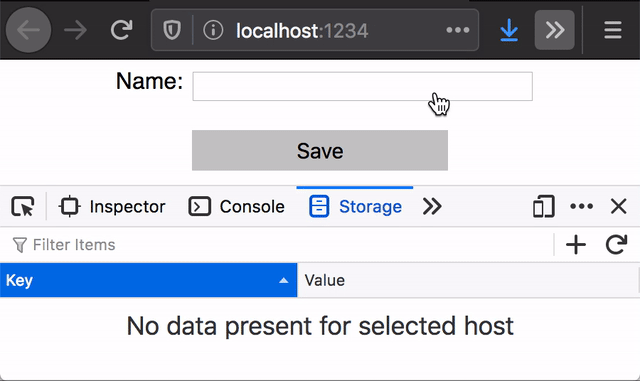
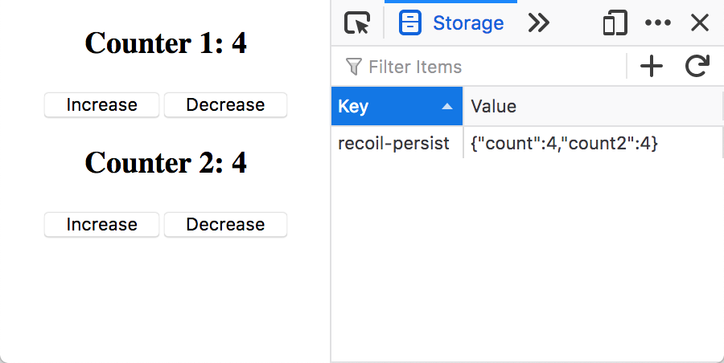

# Recoil Persist

Tiny module for [recoil](https://recoiljs.org) to store and sync state to
`Storage`. It is only 354 bytes (minified and gzipped). No dependencies.
[Size Limit](https://github.com/ai/size-limit) controls the size.

[Demo](https://polemius.dev/recoil-persist/)

If you are using recoil-persist with version 1.x.x please check
[migration guide](https://github.com/polemius/recoil-persist#migration-from-version-1xx-to-2xx)
to version 2.x.x.



```js
import React from 'react'
import ReactDOM from 'react-dom'
import App from './App'
import { atom, RecoilRoot, useRecoilState } from 'recoil'
import { recoilPersist } from 'recoil-persist'

const { persistAtom } = recoilPersist()

const counterState = atom({
  key: 'count',
  default: 0,
  effects_UNSTABLE: [persistAtom],
})

function App() {
  const [count, setCount] = useRecoilState(counterState)
  return (
    <div>
      <h3>Counter: {count}</h3>
      <button onClick={() => setCount(count + 1)}>Increase</button>
      <button onClick={() => setCount(count - 1)}>Decrease</button>
    </div>
  )
}

ReactDOM.render(
  <React.StrictMode>
    <RecoilRoot>
      <App />
    </RecoilRoot>
  </React.StrictMode>,
  document.getElementById('root'),
)
```

## Install

```
npm install recoil-persist
```

or

```
yarn add recoil-persist
```

Now you could add persisting a state to your app:

```diff
import React from 'react';
import ReactDOM from 'react-dom';
import App from './App';
import { RecoilRoot } from "recoil";
+import { recoilPersist } from 'recoil-persist'

+const { persistAtom } = recoilPersist()

const counterState = atom({
  key: 'count',
  default: 0,
+ effects_UNSTABLE: [persistAtom],
})

function App() {
  const [count, setCount] = useRecoilState(counterState)
  return (
    <div>
      <h3>Counter: {count}</h3>
      <button onClick={() => setCount(count + 1)}>Increase</button>
      <button onClick={() => setCount(count - 1)}>Decrease</button>
    </div>
  )
}

ReactDOM.render(
  <React.StrictMode>
    <RecoilRoot>
      <App />
    </RecoilRoot>
  </React.StrictMode>,
  document.getElementById('root'),
)
```

After this each changes in atom will be store and sync to `localStorage`.

## Usage

```js
import { recoilPersist } from 'recoil-persist'

const { persistAtom } = recoilPersist({
  key: 'recoil-persist', // this key is using to store data in local storage
  storage: localStorage, // configure which storage will be used to store the data
  converter: JSON // configure how values will be serialized/deserialized in storage
})
```



## Server Side Rendering

If you are using SSR you could see that error:

```
Unhandled Runtime Error

Error: Text content does not match server-rendered HTML.
```

It happens because on server you don't have any storages and react renders component with default value.
However in browser it is rendering with values from storage.
To prevent it we need to introduce hook for render with default value for the first time.

```js
const defaultValue = [{ id: 1 }]

export const recoilTest = atom<{ id: number }[]>({
  key: "recoilTest",
  default: defaultValue,
  effects_UNSTABLE: [persistAtom],
});

export function useSSR() {
  const [isInitial, setIsInitial] = useState(true);
  const [value, setValue] = useRecoilState(recoilTest);

  useEffect(() => {
    setIsInitial(false);
  }, []);

  return [isInitial ? defaultValue : value, setValue] as const;
}


export default function Component() {
  const [text, setText] = useSSR();

  // rest of the code
}
```


## API

### recoilPersist(config)

#### config parameter

```js
type config.key = String
```

Default value of `config.key` is `recoil-persist`. This key is using to store
data in storage.

```js
type config.storage = Storage
```

Set `config.storage` with `sessionStorage` or other `Storage` implementation to
change storage target. Otherwise `localStorage` is used (default).

```js
type config.converter = {
  stringify: (value: any) => string
  parse: (value: string) => any
}
```

Set `config.converter` to an object which implements both `stringify` and `parse` functions to convert state values to and from strings. One use of this would be to wrap the standard `JSON.stringify` and `JSON.parse` functions, e.g. to insert your own `reviver` and `replacer` functions:

```js
{
  parse: (value) => JSON.parse(value, myCustomReviver),
  stringify: (value) =>  JSON.stringify(value, myCustomReplacer)
};
```

## Migration from version 1.x.x to 2.x.x

The API changed from version 1.x.x.

To update your code just use this migration guide:

```diff
import React from 'react';
import ReactDOM from 'react-dom';
import App from './App';
import { RecoilRoot } from "recoil";
import { recoilPersist } from 'recoil-persist' // import stay the same

const {
-  RecoilPersist,
-  updateState
+  persistAtom
} = recoilPersist(
-   ['count'], // no need for specifying atoms keys
    {
        key: 'recoil-persist', // configuration stay the same too
        storage: localStorage
    }
)

const counterState = atom({
  key: 'count',
  default: 0,
- persistence_UNSTABLE: { // Please remove persistence_UNSTABLE from atom definition
-   type: 'log',
- },
+ effects_UNSTABLE: [persistAtom], // Please add effects_UNSTABLE key to atom definition
})

function App() {
  const [count, setCount] = useRecoilState(counterState)
  return (
    <div>
      <h3>Counter: {count}</h3>
      <button onClick={() => setCount(count + 1)}>Increase</button>
      <button onClick={() => setCount(count - 1)}>Decrease</button>
    </div>
  )
}

ReactDOM.render(
  <React.StrictMode>
-   <RecoilRoot initializeState={({set}) => updateState({set})>
+   <RecoilRoot> // Please remove updateState function from initiallizeState
-     <RecoilPersist /> // and also remove RecoilPersist component
      <App />
    </RecoilRoot>
  </React.StrictMode>,
  document.getElementById('root')
);
```

## Demo

```
$ git clone git@github.com:polemius/recoil-persist.git
$ cd recoil-persist
$ npm install
$ npm run start
```

Please open [localhost:1234](http://localhost:1234).
